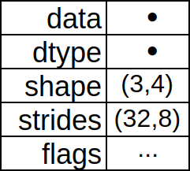

<!-- .slide: data-background="images/intro_background.png" class="background" -->
### **Высокоэффективная обработка данных в Phyton**

#### High Performance Data Processing In Python

<p>
  <a href="http://twitter.com/donald_whyte">@donald_whyte</a>
</p>

<div id="logo-notice">
  
</div>

[NEXT]
<!-- .slide: data-background="images/intro_background.png" class="background" -->
### About Me

<div class="left-col">
  
</div>
<div class="right-col" style="text-center: left">
  <ul>
    <li>Software Engineer</li>
    <li>@ Engineers Gate</li>
    <li>Scalable data infrastructure</li>
    <li>Real-time trading systems</li>
    <li>Python/C++/Rust developer</li>
  </ul>
</div>
<div class="clear-col"></div>

[NEXT]
<!-- .slide: data-background="images/intro_background.png" class="background" -->
**Python is a hugely popular tool for data analysis.**

[NEXT]
<!-- .slide: data-background="images/intro_background.png" class="background" -->

> **Data analysis is now as popular as web development with Python.**

<div class="reference">
  *JetBrains Python Developer Survey 2017* **[1]**
</div>

_note_
https://www.jetbrains.com/research/python-developers-survey-2017/

[NEXT]
<!-- .slide: data-background="images/intro_background.png" class="background" -->
## Why?

[NEXT]
<!-- .slide: data-background="images/intro_background.png" class="background" -->
High-level and easy to use.

Wealth of tools for processing/analysing data.

General-purpose language useful outside of data analysis.

[NEXT]
<!-- .slide: data-background="images/intro_background.png" class="background large-slide" -->
**What about production?**

[NEXT]
<!-- .slide: data-background="images/intro_background.png" class="background" -->
### Isolated to Research?


Large data analysis/processing typically isolated to research.

One-off batch jobs to produce insight for research and decision making.

_note_
Data analysis used to only be active in the realm of research. Analysts would
write one-off jobs that cleaned up data and analysed it. The findings would
then be included in research papers, presentations to management in firms and so on.

It was very rare that you'd run such heavy data analysis frequently in live
production systems.

[NEXT]
<!-- .slide: data-background="images/ml_landscape_dec15.jpg" class="background" -->
### Things Have Changed

More data than ever before.

Machine learning and other statistical models are being run in live, production systems.

[NEXT]
<!-- .slide: data-background="images/intro_background.png" class="background" -->
### Artificial Intelligence
### Projected Global Revenue
<div id="deep-learning-revenue"></div>

<div class="source">
  <p>
    Source: [Tractica December 2017](https://www.tractica.com/newsroom/press-releases/artificial-intelligence-software-market-to-reach-89-8-billion-in-annual-worldwide-revenue-by-2025/)
  </p>
</div>

_note_
Artificial Intelligence software market projected to reach almost $90 billion
by 2025.

[NEXT]
<!-- .slide: data-background="images/intro_background.png" class="background" -->
More data to process.

More numerical models being trained for live use.

Models larger and more complex.

[NEXT]
<!-- .slide: data-background="images/intro_background.png" class="background large-slide" -->
**Strict time requirements.**

[NEXT]
<!-- .slide: data-background="images/intro_background.png" class="background" -->
### The Traditional Process

1. Researcher builds model in their tech of choice
2. Programmer takes research code and rewrites it in heavily optimised C/C++
3. Production code is deployed
4. _Everything works fine_

[NEXT]
<!-- .slide: data-background="images/intro_background.png" class="background" -->
### Success!


[NEXT]
<!-- .slide: data-background="images/intro_background.png" class="background" -->
### The Reality


[NEXT]
<!-- .slide: data-background="images/intro_background.png" class="background" -->
### The Reality
1. Researcher builds model that works on their machine
2. Programmer attempts to rewrite model for production
3. Programmer can't to replicate the researcher's results
4. Everything spends tons of time figuring out why

[NEXT]
<!-- .slide: data-background="images/intro_background.png" class="background" -->
### Results in...


* Significant deployment delays
* Compromises on model accuracy to release it faster

[NEXT]
<!-- .slide: data-background="images/intro_background.png" class="background" -->
### A Better Process
Research and production code is **identical**.

_note_
A better process is to make the research and production code **identical**.
They can be configured differently, but the code which pre-processes the data,
trains the models and executes it in prod should be the same.

[NEXT]
<!-- .slide: data-background="images/intro_background.png" class="background large-slide" -->
### Problem
Pure Python is slow.

_note_
But we like Python because it's easy to use for research.

[NEXT]
<!-- .slide: data-background="images/intro_background.png" class="background" -->
### Python vs. C Performance
<div id="python-vs-c"></div>

<div class="source">
  <p>
    Source: [The Computer Language Benchmarks Game](https://benchmarksgame-team.pages.debian.net/benchmarksgame/faster/python3-gcc.html)
  </p>
</div>

[NEXT]
<!-- .slide: data-background="images/intro_background.png" class="background" -->
### Solution
Python's ecosystem for data science.

[NEXT]
<!-- .slide: data-background="images/ecosystem.png" -->

[NEXT]
<!-- .slide: data-background="images/ecosystem_marked.png" -->

[NEXT]
<!-- .slide: data-background="images/intro_background.png" class="background" -->
### NumPy

<div class="left-col">
  <ul>
    <li>Heart of scientific computing in Python.</li>
    <li>Stores and operates date in C/FORTRAN structures</li>
    <li>Avoids slowness of Python</li>
  </ul>
</div>
<div class="right-col">
  <div style="height: 20px"></div>
  
</div>
<div class="clear-col"></div>

[NEXT]
<!-- .slide: data-background="images/intro_background.png" class="background" -->
Foundation of most scientific computing packages.


[NEXT]
<!-- .slide: data-background="images/intro_background.png" class="background" -->
## Our Focus

Showing how to use NumPy to process numerical data.

Exploring how NumPy leverages vectorisation to dramatically boost performance.

[NEXT]
<!-- .slide: data-background="images/intro_background.png" class="background" -->
### Outline

1. Analyse a large weather dataset
2. Process dataset in **pure Python**
3. Speed up processing using **NumPy** and vectorisation
4. Speed up processing even more using **Numba**

[NEXT]
<!-- .slide: data-background="images/intro_background.png" class="background large-slide" -->
## Final Optimised Solution

1000 times faster than pure Python.


[NEXT SECTION]
## 1. The Dataset


[NEXT]
### Integrated Surface Database (ISD)


_note_
Global database of atmospheric data.

This map shows the spatial distribution of Integrated Surface Database
stations for all time periods.

Source: https://www.ncdc.noaa.gov/isd

[NEXT]
## Measurements

<div class="left-col" style="text-center: center;">
  <p>wind speed and direction</p>
  <p>temperature</p>
  <p>sea level pressure</p>
  <p>sky visibility</p>
</div>
<div class="right-col">
  
</div>
<div class="clear-col"></div>

_note_
Detailed list of fields:

wind speed and direction, wind gust, temperature, dew point, cloud data, sea level pressure, altimeter setting, station pressure, present weather, visibility, precipitation amounts for various time periods, snow depth, and various other elements as observed by each station.

[NEXT]
## Coverage

<div class="left-col">
  
</div>
<div class="right-col" style="text-center: left; padding-top: 12px">
  <p>7 continents</p>
  <p>35,000 weather stations</p>
  <p>1901 to now</p>
  <p>from over 100 data sources</p>
</div>
<div class="clear-col"></div>

[NEXT]
<!-- .slide: class="large-slide" -->
**Total Data Volume > 600GB**

_note_
ISD integrates data from over 100 original data sources, including numerous data formats that were key-entered from paper forms during the 1950s–1970s time frame

[NEXT]
### Example


[NEXT]
| **timestamp**       | **station_id** | **wind_speed_rate** | *...* |
| ------------------- | -------------- | ------------------- | ----- |
| 1995-01-06 03:00:00 | 407060         | 50.0                | ...   |
| 1995-01-06 06:00:00 | 407060         | 70.0                | ...   |
| 1995-01-06 09:00:00 | 407060         | null                | ...   |
| 1995-01-06 12:00:00 | 407060         | 60.0                | ...   |
| 1995-01-06 16:00:00 | 407060         | 20.0                | ...   |

_note_
Wind speed rate = the rate of horizontal travel of air past a fixed point.

UNITS: meters per second
SCALING FACTOR: 10
MISSING VALUE: -9999

http://www.polmontweather.co.uk/windspd.htm

[NEXT]
### Tabriz Wind Speed Rate
##### (2011-12-29 to 2011-12-31)


[NEXT]
# Research Goal
Use IDS data to detect extreme weather events that occurred anywhere on the planet.

[NEXT]
## Detecting Hurricanes


[NEXT]
### Trimmed Data

**ISD-Lite Dataset**

|                 |                          |
| --------------- | ------------------------ |
|**Dates**        | 1991-01-01 to 2011-12-31 |
|**Measurement**  | Wind Speed Rate          |
|**Stations**     | ~6000                    |
|**Rows**         | ~400,000,000             |

_note_
Total stations: 5,700
Total rows: 391,908,527


[NEXT SECTION]
## 2. Let's Use Python


[NEXT]
How do we detect hurricanes?

Finding data points with unusually low/high `wind_speed_rate` values.

[NEXT]
### Detecting Outliers


[NEXT]
### Detecting Outliers

At each point `i` in the time series:

1. Take values in time series between points `i - 30` and `i`
2. Calculate mean and standard deviation
3. Value at `i` is an outlier if it's:
  - more than **6 standard deviations** away from the mean

[NEXT]


[NEXT]
### Problem: Null Values
<table>
  <tr>
    <th>timestamp</th>
    <th>station_id</th>
    <th>wind_speed_rate</th>
  </tr>
  <tr><td>1995-01-06 03:00:00</td><td>407060</td><td>50.0</td></tr>
  <tr><td>1995-01-06 06:00:00</td><td>407060</td><td>70.0</td></tr>
  <tr class="bad-row"><td>1995-01-06 09:00:00</td><td>407060</td><td>null</td></tr>
  <tr><td>1995-01-06 12:00:00</td><td>407060</td><td>70.0</td></tr>
  <tr><td>1995-01-06 17:00:00</td><td>407060</td><td>20.0</td></tr>
</table>

[NEXT]
### Solution: Fill Forward
<table>
  <tr>
    <th>timestamp</th>
    <th>station_id</th>
    <th>wind_speed_rate</th>
  </tr>
  <tr><td>1995-01-06 03:00:00</td><td>407060</td><td>50.0</td></tr>
  <tr><td>1995-01-06 06:00:00</td><td>407060</td><td>70.0</td></tr>
  <tr class="good-row"><td>1995-01-06 09:00:00</td><td>407060</td><td>70.0</td></tr>
  <tr><td>1995-01-06 12:00:00</td><td>407060</td><td>70.0</td></tr>
  <tr><td>1995-01-06 17:00:00</td><td>407060</td><td>20.0</td></tr>
</table>

[NEXT]
## Complete Process


_note_
1. Split full dataset into separate station time series
2. For each weather station time series, detect outliers by:
  1. calculate rolling mean and stdev at each point
  2. check if a point is > 6 stdevs away from its rolling mean value
  3. if so, mark point as outlier
3. generate CSV containing all outliers in each station's data

[NEXT]
### Input

* HDF5 file containing three columns:
  - `timestamp`
  - `station_id`
  - `wind_speed_rate`
* Rows already sorted by station and time

_note_
HDF5 is an open source file format for storing huge amounts of numerical data.

It’s typically used in research applications (meteorology, astronomy, genomics etc.) to distribute and access very large datasets without using a database.

It lets you store huge amounts of numerical data, and easily manipulate that data from NumPy. For example, you can slice into multi-terabyte datasets stored on disk, as if they were real NumPy arrays. Thousands of datasets can be stored in a single file, categorized and tagged however you want.

[NEXT]
### The Code

Source file: `find_outliers_purepy.py`

<pre class="medium"><code data-noescape class="bash">&gt; git clone https://github.com/DonaldWhyte/high-performance-data-processing-in-python/
&gt; cd high-performance-data-processing-in-python/
&gt; cd code/
&gt; python3 -m find_outliers_purepy --help
usage: find_outliers_numpy.py [-h] -i INPUT -m MEASUREMENT -o OUTPUT

optional arguments:
  -h, --help            show this help message and exit
  -i INPUT, --input INPUT
                        path to input HDF5 file containing data to find
                        outliers in
  -m MEASUREMENT, --measurement MEASUREMENT
                        measurement to find outliers in
  -o OUTPUT, --output OUTPUT
                        name of output CSV file that contains outliers
</code></pre>

[NEXT]
### Code Breakdown

|                   |                                                         |
| ----------------- | ------------------------------------------------------- |
| `station_ranges`  | partition full dataset into per-station time series     |
| `fill_forward`    | fill in missing data with previous values               |
| `rolling_average` | computing rolling average at every time point           |
| `rolling_std`     | computing rolling stdev at every time point             |
| `find_outliers`   | get indices of outliers using deviance from rolling avg |
<!-- .element class="medium-table-text" -->

[NEXT]
```bash
> python3 -m find_outliers_purepy \
    --input isdlite.hdf5 \
    --output outliers.csv \
    --measurement wind_speed_rate
Found TODO outliers in TODO stations
Outlier search took TODO
```

[NEXT]
```bash
> cat outliers.csv | head
TODO
```

[NEXT]
### Success!

```bash
TODO: single outlier
```

TODO: show news report of actual incident

[NEXT]
### Performance
* **Time taken:** TODO
* **Average time per row:** TODO

[NEXT]
### Profiling the Code

Let's find out which step(s) were the performance bottlenecks.

```bash
> python3 -m cProfile -o profile_output \
     find_outliers_purepy.py \
     --input isdlite.hdf5 \
     --output outliers.csv \
     --measurement wind_speed_rate
```

[NEXT]
### Visualising Performance Bottlenecks

```bash
> pip3 install snakeviz
> snakeviz profile_output
```

[NEXT]
TODO: show snakeviz output

[NEXT]
### Execution Time Breakdown
<div id="purepython-times"></div>

[NEXT]
TODO: what is Python actually doing under the hood to make it so slow?

[NEXT]
### Reason 1: Memory Indirection
TODO

[NEXT]
### Reason 2: Difficult to Vectorise
TODO


[NEXT SECTION]
## 3. Numpy


[NEXT]
### The Foundation
Fundamental package for high performance computing in Python.

Most higher-level data libraries build on top of NumPy.

[NEXT]
### Features

* `ndarray`, a fast and space-efficient multidimensional array
  - provides vectorized arithmetic operations and sophisticated broadcasting capabilities

[NEXT]
How does it work? Basic primitives, memory layout, stride, etc.

[NEXT]
### `numpy.ndarray`

TODO: summary of why it is (one or many D array of contiguous memory that stores data)

[NEXT]
### `numpy.ndarray`


_note_
`data` is pointer indicating the memory address of the first byte in the array.

`dtype` indicates the type of elements stored in the array.

`shape` indicates the shape of the array. That is, it defines the dimensionality
of the data in the array and how many elements the array stores for each dimension.

The `strides` are the number of bytes that should be skipped in memory to go to the next element. If your strides are (32, 8), you need to proceed 8 bytes to get to the next column and 32 bytes to move to the next row.

`flags` is a set of flags

[NEXT]
### Examples

First, let's import NumPy.

```python
import numpy as np
```

[NEXT]
### Example

```python
>>> a = np.arange(9, dtype=np.float64)
>>> a
array([0., 1., 2., 3., 4., 5., 6., 7., 8.])
>>> a.shape
(9,)
>>> a.strides
(8,)
```
<!-- .element: class="large" -->

[NEXT]
### Memory Layout


### Python View


[NEXT]
### Reshape

```python
>>> b = a.reshape(3, 3)
>>> b
array([[0., 1., 2.],
       [3., 4., 5.],
       [6., 7., 8.]])
```


[NEXT]
### Transpose

```python
>>> b.T
array([[0., 3., 6.],
       [1., 4., 7.],
       [2., 5., 8.]])
```


[NEXT]
### Slicing One Dimension

```python
>>> b[:, :2]
array([[0., 1.],
       [3., 4.],
       [6., 7.]])
```


[NEXT]
### Slicing Multiple Dimensions

```python
>>> b[:2, :2]
array([[0., 1.],
       [3., 4.]])
```


[NEXT]
### Only Examine Every Nth Element

```python
>>> b[::2, ::2]
array([[0., 2.],
       [6., 8.]])
```


[NEXT]
TODO: key takeway -- no copying -- just a view! two perf benefits

[NEXT]
TODO: mention Python/C space thing

[NEXT]
### Keep it in NumPy!

TODO

[NEXT]
### Broadcasting
TODO: broadcasting -- can reduce copies

[NEXT]
### Using NumPy for Outlier Detection

[NEXT]
### Recap

|                   |                                                         |
| ----------------- | ------------------------------------------------------- |
| `station_ranges`  | partition full dataset into per-station time series     |
| `fill_forward`    | fill in missing data with previous values               |
| `rolling_average` | computing rolling average at every time point           |
| `rolling_std`     | computing rolling stdev at every time point             |
| `find_outliers`   | get indices of outliers using deviance from rolling avg |
<!-- .element class="medium-table-text" -->

[NEXT]
`station_ranges()`

TODO

[NEXT]
`fill_forward()`

```python
TODO
```

[NEXT]
`rolling_average()`

```python
TODO
```

[NEXT]
`rolling_std()`

```python
TODO
```

[NEXT]
`find_outliers()`

TODO

[NEXT]
### Execution Time Breakdown
<div id="numpy-times"></div>

[NEXT]
TODO: mid-section summary


[NEXT SECTION]
## 4. Vectorisation


[NEXT]
TODO: why does numpy provide such a speedup?

[NEXT]
TODO: memory efficiency, packed together, less indirection in memory,
helps cache lines, lower level/less instructions

[NEXT]
TODO: but also vectorisation! explain what this is

[NEXT]
TODO: give high-level theoretical example of vectorisation

[NEXT]
TODO: achieved via SIMD -- show CPU register example

[NEXT]
TODO: show basic toy example with timings

[NEXT]
TODO: show numpy code from the example and how it's vectorising

[NEXT]
TODO: graph to recap non-vectorised and vectorised

[NEXT]
TODO: show how you can even improve vectorisation via memory efficiency!

[NEXT]
TODO: another graph to demonstrate speedup

[NEXT]
### Execution Time Breakdown
<div id="vectorised-times"></div>


[NEXT SECTION]
## 5. Numba


_note_
see https://cython.readthedocs.io/en/latest/src/tutorial/numpy.html for examples

[NEXT]
TODO: what is numba

[NEXT]
potentially massive optimisations with a couple of line of code

[NEXT]
TODO: show JIT decorator

[NEXT]
TODO: show what types it deduces under the hood

[NEXT]
### Execution Time Breakdown
<div id="final-times"></div>

[NEXT]
TODO: emphasise that it won't really speed up vectorised numpy code

TODO: but it's good optimising the inherent loops present

[NEXT SECTION]
## Fin


[NEXT]
TODO: show final graphs on log scale of speeds

[NEXT]
TODO: conclusion

[NEXT]
TODO: be sure to emphasise the importance of numerical computation optimisation

[NEXT]
<!-- .slide: class="large-slide" -->
**Спасибо!**

[NEXT]
<!-- .slide: class="small-slide" -->
### Links

* these slides:
  - http://donsoft.io/high-performance-data-processing-in-python
* example code from this talk:
  - https://github.com/DonaldWhyte/high-performance-data-processing-in-python/tree/master/code

[NEXT]
### Get In Touch

<div class="left-col" style="text-center: left">
  <br />
  [don@donsoft.io](mailto:don@donsoft.io)<br />
  [@donald_whyte](http://twitter.com/donald_whyte)<br />
  https://github.com/DonaldWhyte
</div>
<div class="right-col">
  
</div>
<div class="clear-col"></div>


[NEXT SECTION]
## Appendix

[NEXT]
### References

**[1]** https://www.jetbrains.com/research/python-developers-survey-2017/

[NEXT]
### Image Credits

* [Freepik](https://www.freepik.com/)
* [Icon Fonts](http://www.onlinewebfonts.com/icon)
