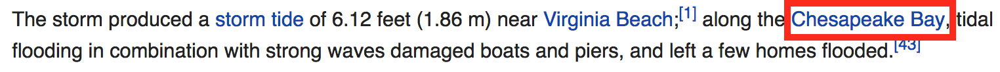
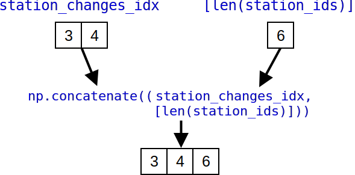

<!-- .slide: data-background="images/intro_background.png" class="background" -->
### **Высокоэффективная обработка данных в Phyton**

#### High Performance Data Processing In Python

<p>
  <a href="http://twitter.com/donald_whyte">@donald_whyte</a>
</p>

<div id="logo-notice">
  
</div>

[NEXT]
<!-- .slide: data-background="images/intro_background.png" class="background" -->
### About Me

<div class="left-col">
  
</div>
<div class="right-col" style="text-center: left">
  <ul>
    <li>Software Engineer</li>
    <li>@ Engineers Gate</li>
    <li>Scalable data infrastructure</li>
    <li>Real-time trading systems</li>
    <li>Python/C++/Rust developer</li>
  </ul>
</div>
<div class="clear-col"></div>

[NEXT]
<!-- .slide: data-background="images/intro_background.png" class="background" -->
**Python is a hugely popular tool for data analysis.**

[NEXT]
<!-- .slide: data-background="images/intro_background.png" class="background" -->

> **Data analysis is now as popular as web development with Python.**

<div class="reference">
  *JetBrains Python Developer Survey 2017* **[1]**
</div>

_note_
https://www.jetbrains.com/research/python-developers-survey-2017/

[NEXT]
<!-- .slide: data-background="images/intro_background.png" class="background" -->
## Why?

[NEXT]
<!-- .slide: data-background="images/intro_background.png" class="background" -->
High-level and easy to use.

Wealth of tools for processing/analysing data.

General-purpose language useful outside of data analysis.

[NEXT]
<!-- .slide: data-background="images/intro_background.png" class="background" -->
## Suitable for **Research**

* TODO
* TODO

[NEXT]
<!-- .slide: data-background="images/intro_background.png" class="background" -->
## Suitable for **Production**

* TODO
* TODO

[NEXT]
<!-- .slide: data-background="images/intro_background.png" class="background" -->
## Python's Strengths
Python suitable for **both use cases**.

Enables researchers to run experiments quickly.

Use same code in prod as research.

[NEXT]
<!-- .slide: data-background="images/intro_background.png" class="background large-slide" -->
**Pure Python is slow.**

[NEXT]
<!-- .slide: data-background="images/intro_background.png" class="background" -->
### Python vs. C Performance
<div id="python-vs-c-speedups"></div>

<div class="source">
  <p>
    Source: [The Computer Language Benchmarks Game](https://benchmarksgame-team.pages.debian.net/benchmarksgame/faster/python3-gcc.html)
  </p>
</div>

[NEXT]
<!-- .slide: data-background="images/intro_background.png" class="background large-slide" -->
## Bad for Research

TODO

[NEXT]
<!-- .slide: data-background="images/intro_background.png" class="background large-slide" -->
## Bad for Production

TODO

[NEXT]
<!-- .slide: data-background="images/intro_background.png" class="background large-slide" -->
## Solution
Python's data processing ecosystem.

[NEXT]
<!-- .slide: data-background="images/ecosystem.png" -->

[NEXT]
<!-- .slide: data-background="images/ecosystem_marked.png" -->

[NEXT]
<!-- .slide: data-background="images/intro_background.png" class="background" -->
### NumPy

<div class="left-col">
  <ul>
    <li>Heart of scientific computing in Python</li>
    <li>Stores and operates on data in C structures</li>
    <li>Avoids slowness of Python</li>
  </ul>
</div>
<div class="right-col">
  <div style="height: 20px"></div>
  
</div>
<div class="clear-col"></div>

[NEXT]
<!-- .slide: data-background="images/intro_background.png" class="background" -->
Foundation of most scientific computing packages.


[NEXT]
<!-- .slide: data-background="images/intro_background.png" class="background" -->
## Our Focus

Showing how to use NumPy to process numerical data.

Exploring how NumPy uses vectorisation to dramatically boost performance.

[NEXT]
<!-- .slide: data-background="images/intro_background.png" class="background" -->
### Outline

1. Analyse a large weather dataset
2. Process dataset in **pure Python**
3. Speed up processing using **NumPy** and vectorisation
4. Speed up processing even more using **Numba**

[NEXT]
<!-- .slide: data-background="images/intro_background.png" class="background large-slide" -->
## Final Optimised Solution

1145 times faster than pure Python.


[NEXT SECTION]
## 1. Let's Make Some Cash


[NEXT]


TODO

[NEXT]
<!-- .slide: class="large-slide" -->
**Prices of 7000+ US stocks.**

**From 1962 to 2017.**

[NEXT]
<!-- .slide: class="medium-slide" -->
Collection of **CSV** files.


[NEXT]
`aapl.us.txt`


[NEXT]


[NEXT]
<!-- .slide: class="large-slide" -->
## Total Dataset Size

Over 6,000,000 rows.

1 gigabyte.


[NEXT]
# Goal
Build an automated program for TODO.

[NEXT]
## How?
We leverage **two fundamental behaviours** about stock prices.


[NEXT]
## 1. Prices Revert to the Mean

[NEXT]


[NEXT]


[NEXT]


`return = price_today - price_yesterday`

^--- highlight this better

[NEXT]
TODO: return graph with outlier boundary lines

[NEXT]
TODO: return graph with first outlier highlighted (buy)

[NEXT]
TODO: return graph with sell point highlighted

[NEXT]
TODO: return graph with second outlier highlighted (sell)

[NEXT]
TODO: return graph with second outlier highlighted (buy back)

[NEXT]
show total profit made


[NEXT]
## 2. Stocks are Correlated

[NEXT]
TODO: positively correlated stock graph


[NEXT]
TODO: negatively correlated stock graph


[NEXT]
TODO: what these mean together


[NEXT SECTION]
## 2. The Strategy


[NEXT]
Choose 3000 stocks to trade.

[NEXT]
Every day before the stock market opens:

1. calculate each stock's daily returns for each day over last yea
  - 3000 * 252 matrix
2. TODO
3. calculate correlation matrix

_note_
TODO: animate this as per Grig's advice

[NEXT]


[NEXT]
### Running the Code

```
> python3 -m find_outliers_purepy \
    --input isdlite.hdf5 \
    --output outliers.csv \
    --measurement wind_speed_rate
```

```
Determining range of each station time series
Found time series for 5183 ranges
Removing time series that don't have enough data
Kept 4695 / 5183 station time series
Computing outliers
Computed outliers in 14499.84 seconds
Writing outliers to outliers.csv
```

[NEXT]
### Output Outliers CSV

| **station_id** | **timestsamp**      | **wind_speed_rate** |
| -------------- | ------------------- | ------------------- |
| 720346         | 1996-04-25 11:00:00 | 110.0               |
| 720358         | 1997-01-31 09:00:00 | 40.0                |
| 997375         | 1993-01-29 15:00:00 | 100.0               |
| ...            | ...                 | ...                 |

[NEXT]
Some detected outliers:

```bash
997299,2006-09-01 09:00:00,400.0
997299,2006-09-01 12:00:00,400.0
```

The affected weather station is:
```bash
> grep 997299 stations.csv
"997299","99999","CHEASAPEAKE BRIDGE","US","VA","","+36.970","-076.120","+0016.0","20050217","20161231"
```

[NEXT]


[NEXT]


[NEXT]


[NEXT]
### Success!
<span style="font-size: 120px">🎉</span>

[NEXT]
<!-- .slide: class="large-slide" -->
## Time Taken
4 hours.

[NEXT]
## The Ultimate Goal
Use IDS data to detect extreme weather events that happen anywhere on the planet.

[NEXT]
### Detecting Outliers in the Full Dataset

All 8 measurements.

All 35,000 weather stations.

From 1901 to now.

_note_
What if we ran the same outlier detection code on the full dataset?

[NEXT]
<!-- .slide: class="large-slide" -->
It would take **27 days**.


[NEXT]
<!-- .slide: class="large-slide" -->
What went wrong?


[NEXT]
## Finding Outliers
### Execution Time Breakdown

[NEXT]
**Total time:** 4 hours (14530 secs)

<div id="purepython-times"></div>

[NEXT]
**Total time:** 4 hours (14530 secs)

<div id="purepython-times-log"></div>

[NEXT]
<!-- .slide: class="large-slide" -->
Why is Python so slow?

_note_
Source for upcoming sections: https://jakevdp.github.io/blog/2014/05/09/why-python-is-slow/

[NEXT]
## Reason 1
### Dynamic Typing

[NEXT]
When a Python program executes, the interpreter doesn't know the type of the
variables that are defined.


[NEXT]
More instructions needed for any operation.

**Primary reason** Python is slower than C or other compiled languages
for processing numerical data.

[NEXT]
## Reason 2
### Interpreted, not Compiled

[NEXT]
Python code is interpreted at runtime.

Quick to iterate, but gives less chance to optimise.

During compilation, a smart compiler can look ahead and optimise inefficient code.

_note_
See section 5 to learn see how compiling Python code can dramatically speed up
code.

[NEXT]
## Reason 3
### Fragmented Memory Access

[NEXT]


[NEXT]
Bad for code that steps through **data in sequence**.

Iterate through a single list accesses completely different regions of memory.

Not **cache friendly**.


[NEXT SECTION]
## 3. Numpy


[NEXT]
### The Foundation
Fundamental package for high performance computing in Python.

Many libraries/frameworks are built on top of NumPy.

[NEXT]
### Features

* multi-dimensional array objects
* routines for fast operations on arrays
  - mathematical, logical, sorting, selecting
* efficient loading/saving of numerical data to disk
  - including HDF5

[NEXT]
`numpy.ndarray`

* class encapsulating n-dimensional arrays
* fixed size
* elements must be the same type

_note_
At the core of the NumPy package, is the ndarray object. This encapsulates
n-dimensional arrays of homogeneous data types, with many operations being
performed in compiled code for performance.

[NEXT]
## Examples

```python
import numpy as np
```
<!-- .element: class="large" -->

[NEXT]
### Creating an Array

```python
>>> a = np.arange(9, dtype=np.float64)
>>> a
array([0., 1., 2., 3., 4., 5., 6., 7., 8.])
>>> a.shape
(9,)
>>> a.strides
(8,)
```
<!-- .element: class="large" -->

[NEXT]
### Memory Layout


_note_
A NumPy array in its simplest form is a Python object build around a C array.
That is, it has a pointer to a contiguous data buffer of values.

`data` is pointer indicating the memory address of the first byte in the array.

`dtype` indicates the type of elements stored in the array.

`shape` indicates the shape of the array. That is, it defines the dimensionality
of the data in the array and how many elements the array stores for each dimension.

The `strides` are the number of bytes that should be skipped in memory to go to the next element. If your strides are (32, 8), you need to proceed 8 bytes to get to the next column and 32 bytes to move to the next row.

`flags` is a set of configurable flags we don't need to cover here.

### Python View


[NEXT]
### Reshape

```python
>>> b = a.reshape(3, 3)
>>> b
array([[0., 1., 2.],
       [3., 4., 5.],
       [6., 7., 8.]])
```


[NEXT]
### Slicing One Dimension

```python
>>> b[:, :2]
array([[0., 1.],
       [3., 4.],
       [6., 7.]])
```


[NEXT]
### Slicing Multiple Dimensions

```python
>>> b[:2, :2]
array([[0., 1.],
       [3., 4.]])
```


[NEXT]
Reshaping or slicing arrays creates a **view**.

No copies are made.

[NEXT]
### Performance Benefits

* Data stored contiguously
  - no memory overhead
  - cache locality
* No copies for common reshaping/slicing operations
* Fast logical and mathematical operations
  - executed in heavily optimised compiled code

[NEXT]
### Benchmark
#### Adding 10,000,000 Numbers

[NEXT]
### Pure Python

```python
a = list(range(10000000))
b = list(range(10000000))

# 1. indexing
c = [a[i] + b[i] for i in range(len(a))]
```
<!-- .element: class="large" -->

[NEXT]
### NumPy

```python
import numpy as np

a = np.arange(10000000)
b = np.arange(10000000)

# 2. loop
c = np.zeros(len(a))
for i in range(len(a)):
    c[i] = a[i] + b[i]

# 3. built-in numpy addition operator
d = a + b
```
<!-- .element: class="large" -->

[NEXT]
### Timing (seconds)
<div id="basic-numpy-benchmark-times"></div>

[NEXT]
### Speedup Factor
<div id="basic-numpy-benchmark-speedup"></div>

[NEXT]
NumPy with loops is the slowest of all choices.

Takes **4x** longer than pure Python!

[NEXT]
### Explicitly Looping over Numpy Array


_note_
For every integer, we're making two `__getitem__` calls, performing the
addition in Python and copying each result into the output numpy array with
a call to `__setitem__`.

This dramatically slows down the computation for two reasons:

1. This adds function call overhead. We invoke four Python functions for each
   integer. That's 40,000,000 function calls.
2. It performs three copies for each addition. It copies the `i`th element of
   `a` and `b`, then copies the addition into `c`.
3. The overhead and copies destroy cache locality. The copies are likely in a
   very different part of the address space, meaning the CPU is having to do
   more work to fetch data from RAM, instead of just using its local cache.

[NEXT]
### Using Built-in Addition


_note_
The full addition logic is executed in native, compiled NumPy code. There are
no function call overheads and no copies.

The memory buffers storing `a` and `b` are directly accessed when adding.
Since those buffers are stored contiguously in memory, we're cache friendly.
The CPU has to fetch less data from RAM.

[NEXT]
### Keep it in NumPy!
Don't loop through `np.ndarray`s.

Move the computation to the NumPy/C/native code level where possible.

[NEXT]
### A Problem...
For arrays with the same size, operations are performed element-by-element.

Sometimes we want to apply smaller scalars or vectors to larger arrays.

_e.g. adding one to all elements in an array_

_note_
We want to use NumPy's built-in operations, but we don't want to perform loads of copies to match up the array sizes.

[NEXT]
### Adding 1 to an Array


Adding 1 to **N** elements would take **N -1** copies!

[NEXT]
### Broadcasting
Allows us to apply smaller arrays to larger arrays.

**Without copying.**

[NEXT]
### Broadcasting Scalar to Array


[NEXT]
### Broadcasting Scalar to Array


[NEXT]
### Broadcasting Vector to Array


[NEXT]
### Broadcasting Vector to Array


[NEXT]
### Using NumPy for Outlier Detection

[NEXT]
### Recap

|                   |                                                         |
| ----------------- | ------------------------------------------------------- |
| `station_ranges`  | partition full dataset into per-station time series     |
| `fill_forward`    | fill in missing data with previous values               |
| `moving_average`  | computing moving average at every time point            |
| `moving_std`      | computing moving stdev at every time point              |
| `find_outliers`   | get indices of outliers using deviance from moving avg |
<!-- .element class="medium-table-text" -->

[NEXT]


[NEXT]
`station_ranges()`

```python
def station_ranges(station_ids: np.ndarray) -> np.ndarray:
    is_end_of_series = station_ids[:-1] != station_ids[1:]
    indices_where_stations_change = np.where(
      is_end_of_series == True)[0] + 1
    series_starts = np.concatenate((
        np.array([0]),
        indices_where_stations_change
    ))
    series_ends = np.concatenate((
        indices_where_stations_change,
        np.array([len(station_ids) - 1])
    ))
    return np.column_stack((series_starts, series_ends))
```

[NEXT]
```python
station_ids = np.array([123, 123, 124, 245, 999, 999])
```
<!-- .element class="large" -->


[NEXT]
```python
is_end_of_series = station_ids[:-1] != station_ids[1:]
```
<!-- .element class="large" -->


[NEXT]
```python
indices_where_stations_change = (
    np.where(is_end_of_series == True)[0] + 1)
```
<!-- .element class="large" -->


[NEXT]
```python
series_starts = np.concatenate((
    [0],
    indices_where_stations_change
))
```
<!-- .element class="large" -->


[NEXT]
```python
series_ends = np.concatenate((
    indices_where_stations_change,
    [len(station_ids) - 1]
))
```
<!-- .element class="large" -->


[NEXT]
```python
np.column_stack((series_starts, series_ends))
```
<!-- .element class="large" -->


[NEXT]


[NEXT]
**Total time:** 4 hours ⟶ 1.4 hours

**Speedup:** 2.85x

<div id="numpy-times"></div>

[NEXT]
### Why NumPy is So Much Faster

* No extra memory overhead
* Minimal copying
* Cache friendly
* Operations executed in optimised compiled code

[NEXT]
But also...

[NEXT SECTION]
## 4. Vectorisation


[NEXT]
> Process of converting an algorithm from operating on a **single** value at a
time to operating on a **set** of values at one time.

_note_
Source: https://software.intel.com/en-us/articles/vectorization-a-key-tool-to-improve-performance-on-modern-cpus

[NEXT]
Modern CPUs provide direct support for vector operations.

A **single instruction** is applied to **multiple** data points.

[NEXT]
### Adding Two Vectors
#### Single Instruction Single Data (SISD)


Adding **_N_** numbers takes **_N_** instructions.

[NEXT]
### Adding Two Vectors
#### Single Instruction Multiple Data (SIMD)


Adding **_N_** numbers takes **_N / 4_** instructions.

_note_
Basically for you as a coder, SIMD allows to perform four operations
(reading/writing/calculating) for the price of one instruction. The cost
reduction is enabled by vectorization and data-parallelism. You don’t even have
to handle threads and race conditions to gain this parallelism.


[NEXT]
### Vectorised Definitions

| **Context**     |                                                                                     |
| --------------- | ----------------------------------------------------------------------------------- |
| **Native Code** | Apply single operations to multiple data items at once using special CPU registers. |
| **Python**      | Keeping as much computation in `numpy`/native code as much as possible.             |

Both involve making algorithms use array/vector/matrix based computation (not iterative).

_note_
Vectorization describes the absence of any explicit looping, indexing, etc., in the code - these things are taking place, of course, just “behind the scenes” in optimized, pre-compiled C code. Vectorized code has many advantages, among which are:

* vectorized code is more concise and easier to read
* fewer lines of code generally means fewer bugs
* the code more closely resembles standard mathematical notation (making it easier, typically, to correctly code mathematical constructs)
* vectorization results in more “Pythonic” code. Without vectorization, our code would be littered with inefficient and difficult to read for loops.

[NEXT]
### Vectorisation for Outlier Detection

[NEXT]
**Unvectorised `fill_forward()`**

```python
def fill_forward(arr: np.ndarray):
    prev_val = arr[0]
    for i in range(1, len(arr)):
        if np.isnan(arr[i]):
            arr[i] = prev_val
        else:
            prev_val = arr[i]
```
<!-- .element: class="large" -->

[NEXT]
**Vectorised `fill_forward()`**

```python
def fill_forward(arr: np.ndarray) -> np.ndarray:
    mask = ~np.isnan(arr)
    indices = np.arange(len(arr))
    indices_to_use = np.where(mask, indices, 0)
    np.maximum.accumulate(
        indices_to_use,
        out=indices_to_use)
    return arr[indices_to_use]
```
<!-- .element: class="large" -->

[NEXT]
```python
# wind_speed_rate measurements for a single weather station.
arr = np.array([
    20, 5, 3, 8, np.nan, np.nan, 6, np.nan, 25, 5
])
```


[NEXT]
```python
mask = ~np.isnan(wind_speed_rates)
```
<!-- .element: class="large" -->


[NEXT]
```python
indices = np.arange(len(arr))
```
<!-- .element: class="large" -->


[NEXT]
```python
indices_to_use = np.where(mask, indices, 0)
```
<!-- .element: class="large" -->


[NEXT]
```python
np.maximum.accumulate(indices_to_use, out=indices_to_use)
return wind_speed_rates[indices_to_use]
```
<!-- .element: class="large" -->


[NEXT]
**Unvectorised `moving_average()`**

```python
def moving_average(arr: np.ndarray,
                    n: int) -> np.ndarray:
    avg = np.zeros(len(arr) - n + 1)
    for i in range(len(avg)):
        avg[i] = arr[i:i+n].sum() / n
    return avg
```
<!-- .element: class="large" -->

_note_
Glance over this and the next slide. Just state that this one has
a for loop. We can vectorised and eliminate

[NEXT]
**Vectorised `moving_average()`**

```python
def moving_average(arr: np.ndarray,
                    n: int) -> np.ndarray:
    ret = np.cumsum(arr, dtype=float)
    ret[n:] = ret[n:] - ret[:-n]
    return ret[n - 1:] / n
```
<!-- .element: class="large" -->

[NEXT]
**Total time:** 1.4 hours ⟶ 48 mins

**Speedup:** 2.85x ⟶ 5x

<div id="vectorised-times"></div>


[NEXT SECTION]
## 5. Numba


_note_
see https://numba.pydata.org/ for examples

[NEXT]
<!-- .slide: class="large-slide" -->
Not all algorithms are vectorisable.

_note_
Are these non-vectorisable Python functions doomed to be slow?

[NEXT]
### Solution
Compile non-vectorisable Python code to native machine instructions.

[NEXT]
### Numba

Annotate Python functions with **decorators**.

Compiles them to optimised machine code at runtime.

**Just-in-time (JIT)** compilation.

**LLVM** for compiling to machine instructions.

_note_
Numba gives you the power to speed up your applications with high performance functions written directly in Python. With a few annotations, array-oriented and math-heavy Python code can be just-in-time compiled to native machine instructions, similar in performance to C, C++ and Fortran, without having to switch languages or Python interpreters.

[NEXT]
`numba.jit`

Decorator that tells Numba to compile a function to native instructions.

[NEXT]
### Example
#### Summing an Array of Numbers

```python
def sum_array(arr):
    result = 0
    for i in range(len(arr)):
        result += arr[i]
    return result
```
<!-- .element: class="large" -->

[NEXT]
### Sprinkle Some Numba Magic

<pre class="large"><code data-noescape class="python"><mark>from numba import jit</mark>

<mark>@jit(nopython=True)</mark>
def sum_array(arr):
    result = 0
    for i in range(len(arr)):
        result += arr[i]
    return result
</code></pre>

[NEXT]
### Timing (seconds)
<div id="numba-benchmark-times1"></div>

[NEXT]
### Speedup Factor
<div id="numba-benchmark-speedup1"></div>

[NEXT]
### Type Deduction

Numba automatically deduces the types of JIT-compiled functions.

Uses types of arguments in function's first invocation.

[NEXT]
### Explicitly Set Types

<pre class="large"><code data-noescape class="python">from numba import int64, jit

<mark>@jit(int64(int64[:]), nopython=True)</mark>
def sum_array(arr):
    result = 0
    for i in range(len(arr)):
        result += arr[i]
    return result
</code></pre>

[NEXT]
### Drawbacks

* Numba type inference sometimes fails
* You might need to specify types manually
  - arguably makes code more verbose / harder to read
* Restricted language features using `nopython=True`
  - variable types are fixed
  - cannot use arbitrary classes

_note_
Numba FAQ lists many of the drawbacks:
https://numba.pydata.org/numba-doc/dev/user/faq.html

[NEXT]
### Using Numba for Outlier Detection
Added `@jit(nopython=True)` to all functions.

Explicitly specified types.

[NEXT]
**Total time:** 48 mins ⟶ 2.46 mins

**Speedup:** 5x ⟶ 98x

<div id="numba-times-log"></div>

[NEXT]
**Total time:** 48 mins ⟶ 2.46 mins

**Speedup:** 5x ⟶ 98x

<div id="numba-times"></div>

[NEXT]
### To Summarise
Use vectorised NumPy code where possible.

Fall back to Numba if code cannot be vectorised.


[NEXT SECTION]
## 6. The Final Timings


[NEXT]
## Current Timings
<div id="total-times"></div>

[NEXT]
## Current Speedups
<div id="total-speedups"></div>

[NEXT]
### Main Bottleneck
Computing moving standard deviation.
<div id="parallel-memmap-times2"></div>

[NEXT]
### Vectorised Rolling STD
**Speedup:** 10x
<div id="numba-moving-std-times"></div>

[NEXT]
### Final Speedup
**1145** times faster.
<div id="total-speedups2"></div>

[NEXT]
## The Ultimate Goal
Use IDS data to detect extreme weather events that happen anywhere on the planet.

[NEXT]
### Detecting Outliers in the Full Dataset

All 8 measurements.

All 35,000 weather stations.

From 1901 to now.

_note_
What if we ran the same outlier detection code on the full dataset?

[NEXT]
<!-- .slide: class="large-slide" -->
**27 days** ⟶ **38 minutes**

[NEXT]
On a single Macbook pro.


[NEXT SECTION]
## Fin


[NEXT]
Python is great for research.

Out of the box Python is **slow**.

[NEXT]
**Increasing demands for faster/real-time data processing.**

Processing large volumes of data or training complex machine learning models.

Standard Python in prod **isn't viable** for many use cases.

[NEXT]
Could research in Python then convert the code to a faster language.

Can cause **more problems** than it solves.

[NEXT]
Use Python for research _and_ production.

Possible by using Python's large ecosystem of scientific computing packages.

[NEXT]
Keep computation in **native code** as much possible.

**Vectorise** using NumPy where possible.

Use Numba to optimise **unvectorisable** code.

[NEXT]
`numpy`/`numba` alone can yield 1000x speedup.

[NEXT]
<!-- .slide: class="large-slide" -->
**Спасибо!**

[NEXT]
<!-- .slide: class="small-slide" -->
### Links

* these slides:
  - http://donsoft.io/high-performance-data-processing-in-python
* example code from this talk:
  - https://github.com/DonaldWhyte/high-performance-data-processing-in-python/tree/master/code

[NEXT]
### Get In Touch

<div class="left-col" style="text-center: left">
  <br />
  [don@donsoft.io](mailto:don@donsoft.io)<br />
  [@donald_whyte](http://twitter.com/donald_whyte)<br />
  https://github.com/DonaldWhyte
</div>
<div class="right-col">
  
</div>
<div class="clear-col"></div>


[NEXT SECTION]
## Appendix

[NEXT]
### References

**[1]** https://www.jetbrains.com/research/python-developers-survey-2017/

[NEXT]
### Timing Specifications
All performance timings in these slides were produced by running the code on a
machine with the following specs:

|                |                       |
| -------------- | --------------------- |
| **OS**         | macOS Sierra v10.12.6 |
| **Processor:** | 2.3 GHz Intel Core i5 |
| **Memory:**    | 8 GB 2133 MHz LPDDR3  |

[NEXT]
### Image Credits

* [Freepik](https://www.freepik.com/)
* [Icon Fonts](http://www.onlinewebfonts.com/icon)
* [Appzgear](https://www.flaticon.com/authors/appzgear)
